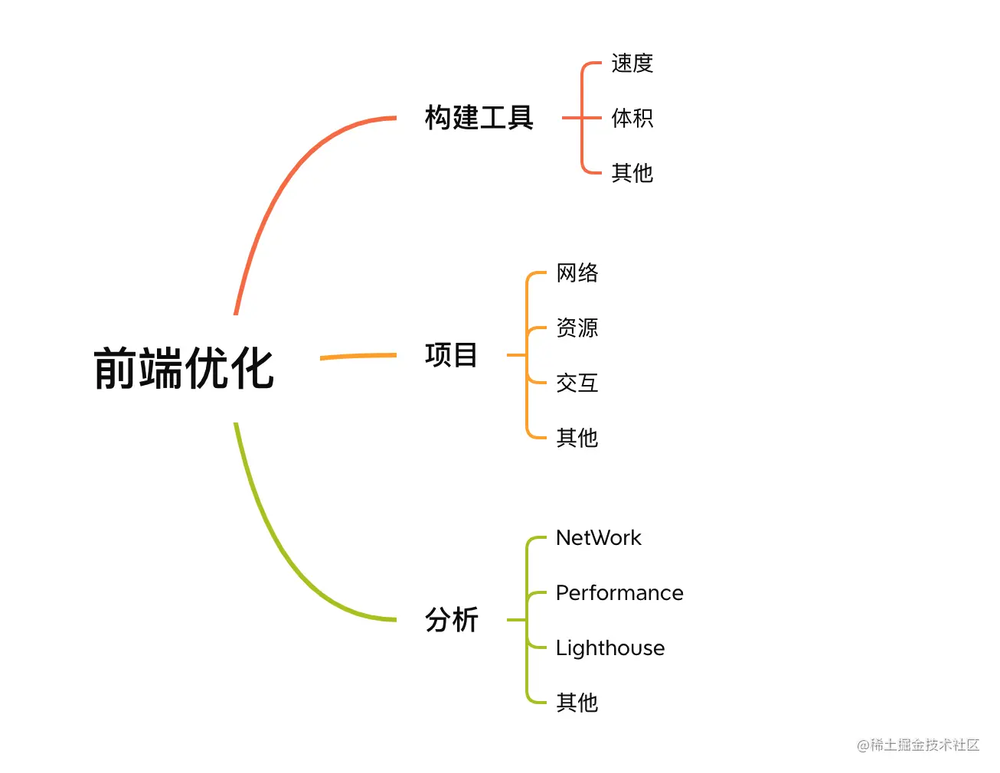

# 分析



- NetWork: 网络面板，用于侦测浏览器资源下载与上传的能耗视图。
- Performance: 性能面板：用于侦测浏览器运行时的性能表现，得出项目运行的时序图，同时也可以分析页面的一些隐式问题，如 (内存泄漏)。
- Lighthouse: 性能评测(灯塔)，基于当前浏览器页面的阶段性加载现状来为用户提供结果分析数据指标报告。
- 探针: 前端框架如React有相关Profiler的探针API和chrome插件，能够为开发者探测代码编写时的问题，避免重复或者是频繁异常的Repeat rendering。

## HTML

- 使用语义化标签和结构
- 减少HTTP请求
- 避免页面重定向 - 页面重定向会导致额外的HTTP请求和延迟，应避免不必要的重定向。
- 使用骨架屏
- 避免触发回流和重绘

## CSS

- 避免过度约束
- 避免后代选择符
- 避免链式选择符
- 使用紧凑的语法
- 避免不必要的命名空间
- 避免不必要的重复
- 最好使用表示语义的名字。一个好的类名应该是描述他是什么而不是像什么
- 避免！important，可以选择其他选择器
- 尽可能的精简规则，你可以合并不同类里的重复规则

## JS

- 避免过多的DOM操作
- 异步加载脚本
- debounce throttle
- 优化循环
- 使用原生数据类型：重复的类型转换会消耗大量的性能
- 使用事件委托代理处理事件
- RAF&RDC：RAF&RDC分别是requestAnimationFrame和requestIdleCallback
- 避免大量操作：如大量生成并添加元素；可以使用集合类型的数据来一次性添加多个元素
- 复杂操作移至后台：如数据处理、排序和过滤等
- 移除不必要的代码和文件
- 合理使用缓存：当服务器端资源发生变化时要正确使用缓存，可以使用 Etag、Last-Modified、Cache-Control 等方式来控制缓存的行为。

以下是一些常用的延迟加载方法：

1. 延迟加载路由
2. 延迟加载 Vuex 模块
3. 延迟加载第三方库
4. 延迟加载组件和图片
5. 按需分割代码块
6. 使用虚拟化列表、分页、无限滚动等技术优化大量数据

## 构建工具

- resolve.modules：

    ```js
    resolve: {
        modules: [path.resolve(__dirname, 'node_modules')],
    }
    ```

- 包体积大小
- 按需加载：针对项目中比较大型的工具类库，如lodash、UI Design、use-hooks等类库
- CDN依赖：对于部分共有依赖可以将其放置在CDN中来进行加载
- minify：
  - JS 压缩：UglifyjsWebpackPlugin
  - HTML 压缩：HtmlWebpackPlugin
  - CSS 压缩：MiniCssExtractPlugin
  - 图片压缩：image-webpack-loader
- Tree Shaking：ES6 的 import/export 来检查未引用代码，以及 sideEffects 来标记无副作用代码，最后用 `UglifyJSPlugin` 来做 `Tree Shaking`，从而删除冗余代码
- `webpack-bundle-analyzer` 分析当前项目中是否存在重复依赖, 影子依赖, 模块体积差异等等问题
- `speed-measure-webpack-plugin` 分析当前每个bundle模块打包构建时的时间数据，分别会包含`loader`, `plugin`等处理的时间
- 构建速度
  - resolve.extensions：extensions:['js', 'json', 'jsx']
  - resolve.include/exclude
  - 缓存：`cache` 或 `cache-loader`：在 `babel-loader` 开启 `cache` 后，将 `loader` 的编译结果写进硬盘缓存，再次构建如果文件没有发生变化则会直接拉取缓存。
  - 多进程构建：thread-loader 和 Happypack
  - 多进程压缩：TerserWebpackPlugin
  - Dll: dll可以将一些依赖库提前进行打包，能够有效的降低打包类库的次数
- 资源加载
  - 静态资源分离：通过 DllPlugin 或者 Externals 进行静态依赖包的分离
  - 代码分离：Code_Splitting 核心是 require-ensure 异步加载资源 SplitChunksPlugin
  - 首页预载 关键页预载 接口优化 浏览器缓存: 策略大体上分为强缓存和协商缓存

## Vue

- 使用v-if和v-show适当地控制组件的显示
- 使用虚拟列表
- 懒加载

- Introduction to performance optimization and lazy loading.
- Lazy loading routes and vendor bundle anti-pattern.
- Lazy loading Vuex modules
- Delivering good waiting experience and lazy loading individual components
- Lazy loading libs and finding smaller equivalents
- Performance-friendly usage of UI libraries
- Making use of Service Worker cache
- Prefetching

## React

- 使用useMemo()缓存计算结果
- 使用useCallback()缓存函数
- 使用useRef()访问DOM元素
- 使用useContext()避免组件传递
- 使用useEffect()加载数据
- 使用React.lazy()和Suspense异步加载模块
- 减少重渲染
- 使用React.lazy()和Code Splitting

## 服务器

- 服务端渲染（Server-Side Rendering）：SSR 主要用于解决单页应用首屏渲染慢以及 SEO 问题
- 负载均衡
  - PM2：一款 Node.js 进程管理器，让计算机每一个内核都启动一个 Node.js 服务，并且实现自动控制负载均衡。
  - Nginx：通过轮询机制，将用户的请求分配到压力较小的服务器上（反向代理）。

## 原则

- 单一职责原则
- 里氏替换原则
- 依赖倒置原则
- 接口隔离原则
- 迪米特原则
- 开放封闭原则

## 模式

- 工厂模式
- 单例模式
- 代理模式
- 中介者模式
- 发布-订阅模式（观察者模式）

## 工程化实践

 脚手架 、 组件库 、 工具库 、 多包 仓库 、 私有仓库 、 接口系统 、 文档系统 、 监控系统 、 CI/CD 、 可移植容器

### 模块规范

模块化/组件化

### 代码规范

### 提交规范

### 服务器

### 域名系统

### 站服务器

### HTTPS

### CDN 资源加速

### Node 环境管理

### NPM 镜像管理

### 数据管理

### 进程管理

### Webpack 打包优化

### 类库打包

### 单元测试

### 多包仓库

### 开源输出

### 文档站点

### CICD 持续集成
