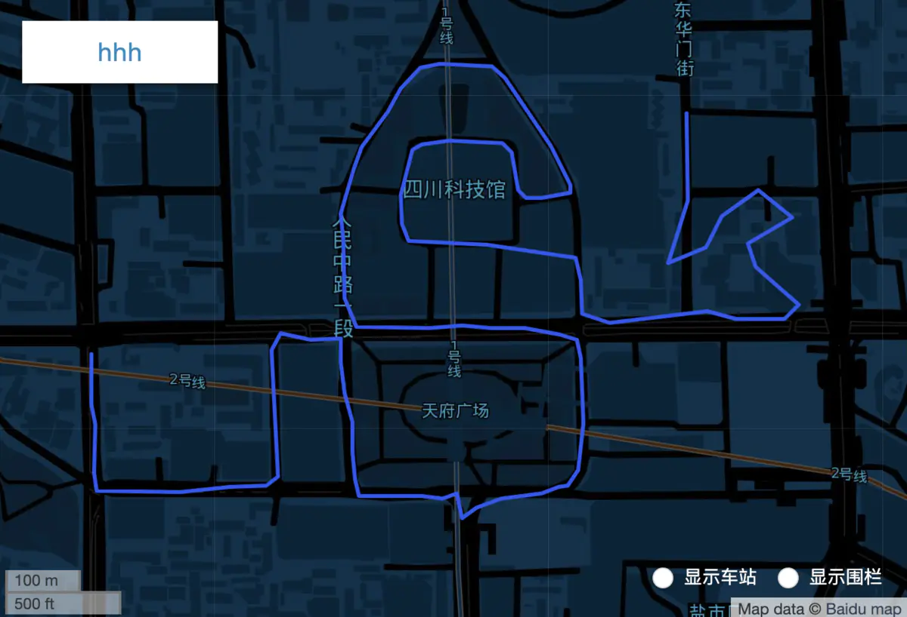

# 原理

1. 将轨迹的首尾点连成一条线，计算曲线上每一个点到直线的距离，找出最大距离dmax，看距离是否小于给定的阈值max（及轨迹精确度）。
2. 根据dmax与max的关系处理曲线：
   1. a.若dmax < max，则舍弃这条曲线上的所有中间点，将曲线首尾点连成的直线作为这段曲线的近似，这条线段便处理完毕。
   2. b.若dmax >= max，则以dmax所在点作为分割点，将原来的曲线分为两段，分出来的两条曲线继续直线步骤1、2，直到所有的dmax < max。

## 代码展示

```js
/**
 * gps轨迹抽稀算法
 */
/**
 * 点到直线的距离，直线方程为 ax + by + c = 0
 * @param {Number} a 直线参数a
 * @param {Number} b 直线参数b
 * @param {Number} c 直线参数c
 * @param {Object} xy 点坐标例如{ lat: 2, lng: 2 }
 * @return {Number}
 */
function getDistanceFromPointToLine(a, b, c, xy) {
    const x = xy.lng;
    const y = xy.lat;
    return Math.abs((a * x + b * y + c) / Math.sqrt(a * a + b * b));
}

/**
 * 根据两个点求直线方程 ax+by+c=0
 * @param {Object} xy1 点1,例如{ lat: 1, lng: 1 }
 * @param {Object} xy2 点2,例如{ lat: 2, lng: 2 }
 * @return {Array} [a,b,c] 直线方程的三个参数
 */
function getLineByPoint(xy1, xy2) {
    const x1 = xy1.lng; // 第一个点的经度
    const y1 = xy1.lat; // 第一个点的纬度
    const x2 = xy2.lng; // 第二个点的经度
    const y2 = xy2.lat; // 第二个点的纬度

    const a = y2 - y1;
    const b = x1 - x2;
    const c = (y1 - y2) * x1 - y1 * (x1 - x2);

    return [a, b, c];
}
/**
 * 稀疏点
 * @param {Array} points 参数为[{lat: 1, lng: 2},{lat: 3, lng: 4}]点集
 * @param {Number} max 阈值,越大稀疏效果越好但是细节越差
 * @return {Array} 稀疏后的点集[{lat: 1, lng: 2},{lat: 3, lng: 4}]，保持和输入点集的顺序一致
 */
function sparsePoints(points, max) {
    if (points.length < 3) {
        return points;
    }
    const xy1 = points[0]; // 取第一个点
    const xy2 = points[points.length - 1]; // 取最后一个点
    const [a, b, c] = getLineByPoint(xy1, xy2); // 获取直线方程的a,b,c值

    let ret = []; // 最后稀疏以后的点集
    let dmax = 0; // 记录点到直线的最大距离
    let split = 0; // 分割位置
    for (let i = 1; i < points.length - 1; i++) {
        const d = getDistanceFromPointToLine(a, b, c, points[i]);
        if (d > dmax) {
            split = i;
            dmax = d;
        }
    }

    if (dmax > max) {
        // 如果存在点到首位点连成直线的距离大于max的,即需要再次划分
        // 按split分成左边一份，递归
        const child1 = sparsePoints(points.slice(0, split + 1), max);
        // 按split分成右边一份，递归
        const child2 = sparsePoints(points.slice(split), max);
        // 因为child1的最后一个点和child2的第一个点,肯定是同一个（即为分割点）,合并的时候,需要注意一下
        ret = ret.concat(child1, child2.slice(1));
        return ret;
    } else {
        // 如果不存在点到直线的距离大于阈值的,那么就直接是首尾点了
        return [points[0], points[points.length - 1]];
    }
}

export default sparsePoints;

```

## 效果展示

数据点类型为类似30.664147,104.067232，抽稀阈值为0.000005，第一张图为原始gps数据，共265个点，第二张图为抽稀之后的数据，共108个点。

### 原图


### 处理后



[原文链接](https://www.jianshu.com/p/046bcaeb2cb6)
